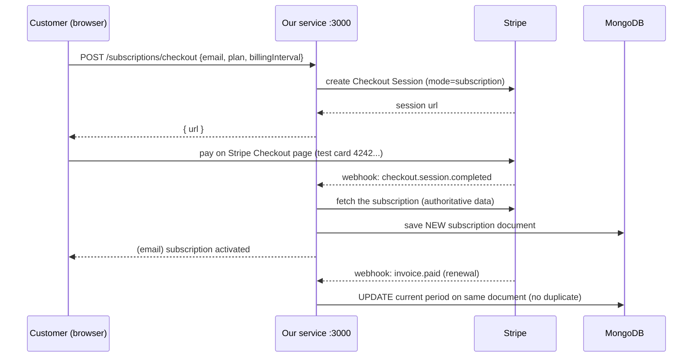
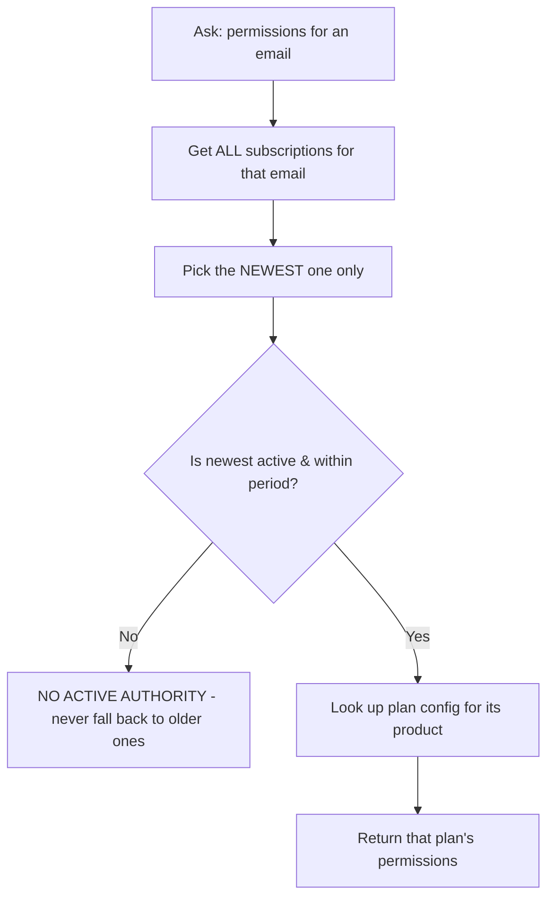

# Traderverse Subscription Service — Easy Guide

A simple, plain-English map of this project: **what runs where, which endpoint
does what, and how the money/subscription flow works.**

---

## 1. What is this project?

A small backend service (runs on **Bun**) that:

- Lets a customer **buy a plan** (Basic / Pro / Enterprise) using Stripe Checkout.
- **Listens to Stripe webhooks** and saves each subscription into **MongoDB**.
- Tells other apps **what a user is allowed to do** (entitlement) — based on
  **only the newest subscription**.

> Stripe = source of truth for billing. MongoDB = our saved copy of it.

---

## 2. Tech stack

| Thing | Used |
| --- | --- |
| Runtime | Bun |
| Web framework | Hono (routes/controllers) |
| Payments | Stripe SDK |
| Database | MongoDB (driver `mongodb`) |
| Emails | SendGrid or Mailgun (REST, no extra SDK) |
| Tests | `bun test` |

---

## 3. Folder map — "where is what"

```
src/
├── index.ts                    # Server start (entry point) — listens on PORT
├── app.ts                      # Wiring — connects all pieces + defines route paths
│
├── config/
│   ├── env.ts                  # Reads environment variables (.env)
│   ├── stripe.ts               # Creates the Stripe client
│   └── plans.ts                # ⭐ PLAN & PRICE SETTINGS (product→plan map, allowed prices)
│
├── database/
│   ├── mongodb.ts              # Connects to MongoDB
│   └── indexes.ts              # MongoDB indexes (uniqueness rules)
│
├── modules/
│   ├── checkout/
│   │   ├── checkout.controller.ts   # Route: POST /subscriptions/checkout
│   │   └── checkout.service.ts      # Creates the Stripe Checkout session
│   │
│   ├── subscriptions/
│   │   ├── subscription.types.ts    # Shape of a subscription document (types)
│   │   ├── subscription.repository.ts # Talks to MongoDB (save/find/update)
│   │   ├── subscription.service.ts  # Converts Stripe events → MongoDB updates
│   │   ├── entitlement.service.ts   # ⭐ The "newest subscription wins" logic
│   │   └── entitlement.controller.ts# Route: GET /subscriptions/entitlement
│   │
│   ├── webhooks/
│   │   ├── stripe-webhook.controller.ts # Route: POST /webhooks/stripe
│   │   └── stripe-webhook.service.ts    # Verifies signature + idempotency + dispatch
│   │
│   └── email/
│       ├── email.service.ts       # Sends activation/renewal/failure emails
│       └── providers/             # sendgrid.provider.ts, mailgun.provider.ts
│
├── utils/
│   ├── logger.ts                  # Logging
│   └── email.ts                   # Email validation
└── test/                          # All tests (bun test)
```

**The one file you edit for plan/price changes:** `src/config/plans.ts`
(it already has your real Stripe test IDs as constants).

---

## 4. Endpoints — "which route is where"

| Method & path | File that handles it | What it does |
| --- | --- | --- |
| `GET /health` | `src/app.ts` | Simple "am I alive" check |
| `POST /subscriptions/checkout` 🔑 | `checkout.controller.ts` → `checkout.service.ts` | Starts a Stripe Checkout for a plan — requires `x-api-key` header |
| `GET /subscriptions/entitlement` 🔒 | `entitlement.controller.ts` → `entitlement.service.ts` | Returns the caller's current permissions — email taken from the Keycloak token (client never sends it) |
| `POST /subscriptions/cancel/:stripeSubscriptionId` 🔒 | `subscriptions/cancel.controller.ts` → `subscription.service.ts` | Cancel a subscription — subscription id in the URL path, email taken from the Keycloak token |
| `POST /webhooks/stripe` | `stripe-webhook.controller.ts` → `stripe-webhook.service.ts` | Receives Stripe events (Stripe calls this) |
| `GET /docs` | `swagger.ts` | Swagger UI — browse & try all APIs with descriptions |
| `GET /openapi.json` | `swagger.ts` | Machine-readable OpenAPI 3 spec |

### 4.1 Create a Checkout session (API-key protected)
```bash
# The x-api-key header value is API_KEY from .env
curl -X POST http://localhost:3000/subscriptions/checkout \
  -H "Content-Type: application/json" \
  -H "x-api-key: tv-checkout-dev-4f8c9a3b2e7d1f6a" \
  -d '{"email":"user@example.com","plan":"pro","billingInterval":"month"}'
```
**What happens:**
1. Checks the email is valid.
2. Checks the `plan` name is one of `basic` | `pro` | `enterprise` and the
   interval is `month` | `year` (default `month`).
3. The backend **resolves the Stripe price** from `src/config/plans.ts`
   (the client never sends a Stripe price id).
4. Asks Stripe to make a Checkout session (mode = subscription).
5. Returns `{ url, id, email, plan, billingInterval, productId, priceId }`.
6. Open the `url` in a browser → customer pays with Stripe.

### 4.2 Check a user's entitlement (PROTECTED)
```bash
# The Keycloak token decides WHO you are — no email is sent in the request.
curl "http://localhost:3000/subscriptions/entitlement" \
  -H "Authorization: Bearer <KEYCLOAK_TOKEN>"
```
Returns something like (email comes from the token):
```json
{
  "email": "user@example.com",
  "active": true,
  "reason": "active",
  "plan": "pro",
  "productId": "prod_VDskx9YEWVcWlm",
  "config": { "canCreatePost": true, "maxPosts": 100 },
  "subscriptionId": "sub_xxx",
  "subscription": { "...": "..." }
}
```
If the **newest** subscription is inactive, you get `"active": false` — even if an
older subscription is still active (strict rule — no fallback).

### 4.3 Stripe webhook (called BY Stripe, not by you)
```text
POST http://localhost:3000/webhooks/stripe
```
Stripe sends events here. The service:
1. Verifies the `Stripe-Signature` header (raw body).
2. Ignores duplicate events (idempotency).
3. Updates MongoDB accordingly.

Supported events:
```
checkout.session.completed
customer.subscription.created
customer.subscription.updated
customer.subscription.deleted
invoice.paid
invoice.payment_failed
```

---

## 5. How money flows (diagram)



---

## 6. Entitlement logic — the "newest subscription wins" rule



Important:
- Older subscriptions are **ignored** for current permissions.
- If the newest is canceled/past-due/expired → user has **no authority**,
  even if an older one is still active.
- **One active subscription per user:** when a new plan is purchased and its
  payment succeeds, the user's older *active* subscriptions are **automatically
  unsubscribed on Stripe** (history documents are preserved).
- **Default FREE plan:** if the user has no valid paid subscription, the API
  returns the built-in **`free`** plan (`reason: "free"`, `isFreePlan: true`).
  It is config-only — **not linked to Stripe** (`productId: null`).

---

## 7. Database (MongoDB)

Database name: `shaheer-subscribtion-test` (set in `.env`)

### Collection `subscriptions` — one document per Stripe subscription
```json
{
  "_id": "...",
  "email": "user@example.com",
  "stripeCustomerId": "cus_xxx",
  "stripeSubscriptionId": "sub_xxx",
  "productId": "prod_xxx",
  "priceId": "price_xxx",
  "plan": "pro",
  "billingInterval": "month",
  "status": "active",
  "currentPeriodStart": "2026-09-08T00:00:00.000Z",
  "currentPeriodEnd": "2026-10-08T00:00:00.000Z",
  "cancelAtPeriodEnd": false,
  "createdAt": "...",
  "updatedAt": "..."
}
```
Notes:
- **No `userId`** — email is the user reference for now.
- One email can have **many** documents (many subscriptions) — never merged/overwritten.
- `stripeSubscriptionId` is **unique**.

### Collection `stripe_events` — webhook idempotency
```json
{ "_id": "...", "stripeEventId": "evt_xxx", "type": "invoice.paid", "status": "processed", "processedAt": "..." }
```
`stripeEventId` is unique → same event delivered twice is ignored.

---

## 8. Emails

| Event | Email sent |
| --- | --- |
| First successful subscription | "subscription is active" |
| Successful renewal (`invoice.paid`, not the first one) | "Payment received" |
| Failed payment (`invoice.payment_failed`) | "Payment failed" |

`EMAIL_PROVIDER=none` = emails are only **logged** (not sent) — good for testing.

---

## 9. Configuration files you will touch

| File | What it controls |
| --- | --- |
| `.env` | Secrets & settings (Stripe keys, Mongo, URLs, email). **Gitignored — never commit.** |
| `.env.example` | Local-only template — NOT tracked/pushed. Create config from `.env` directly. |
| `src/config/plans.ts` | ⭐ Which product = which plan, which price IDs are allowed, permission values. |

---

## 10. Everyday commands

```bash
bun install        # install dependencies
bun run dev        # start the service (watch mode) on http://localhost:3000
bun start          # start the service (production mode)
bun run typecheck  # check TypeScript errors
bun test           # run tests (26 tests)

# Forward Stripe webhooks to the local service (keep running):
#   1) stripe login            (if not logged in with a valid key)
#   2) stripe listen --forward-to http://localhost:3000/webhooks/stripe
#   3) copy the printed whsec_... into .env as STRIPE_WEBHOOK_SECRET
#   4) restart `bun run dev`
```

### Test the whole flow locally
1. Keep `stripe listen` and `bun run dev` running.
2. Create a checkout session (endpoint 4.1).
3. Open the returned URL and pay with test card **`4242 4242 4242 4242`**.
4. Watch the `stripe listen` terminal → events forwarded → subscription saved in Mongo.
5. Check entitlement with endpoint 4.2.

---

## 11. Tests (what's covered)

`bun test` runs 26 tests:
- duplicate webhooks (ignored safely)
- multiple subscriptions for one email
- newest-plan selection
- newest inactive + older active → **no** authority
- recurring payment updates (no duplicate document)
- payment failure
- cancellation (record preserved)
- monthly vs annual prices → same plan
- invalid plan names / intervals rejected
- invalid webhook signature rejected

---

## 12. Stripe Dashboard — step by step (the "remaining" setup)

Everything below happens in the **Stripe Dashboard** (https://dashboard.stripe.com).
Do it in **Test mode** first — the toggle is in the top-right corner. All the keys
we use are test keys, so the dashboard **must** be in Test mode.

### Step 1 — Turn on Test mode
- Top-right toggle → **Test mode** (shows "Testing" / yellow banner).
- While in Test mode you only see test products, prices and keys — this matches
  our `.env`.

### Step 2 — Verify your Products & Prices
- Go to **Billing → Products** (dashboard.stripe.com/test/products).
- You should see: **Basic**, **Pro**, **Enterprise**.
- Open each product and check it has **two recurring prices** (monthly + yearly).
- Copy the IDs and compare with `src/config/plans.ts` constants — they must match
  exactly (yours are already filled in, this is just a sanity check).
  - Make sure each price says **Recurring**, interval `Month` / `Year`
    (NOT one-time).

### Step 3 — Confirm the API keys
- Go to **Developers → API keys**.
- Copy the **Secret key** (`sk_test_...`) — it should match `.env`
  `STRIPE_SECRET_KEY` (already set).
- Copy the **Publishable key** (`pk_test_...`) — this one goes in your
  **frontend**, not the server.

### Step 4 — Webhooks
Two different situations:

**A) Local development (what you're doing now):**
- You do NOT create a webhook in the Dashboard. Instead use the CLI:
  ```bash
  stripe listen --forward-to http://localhost:3000/webhooks/stripe
  ```
- Keep it running, copy the printed `whsec_...` into `.env`
  `STRIPE_WEBHOOK_SECRET`, then restart `bun run dev`.

**B) When the service is deployed (production / shared server):**
1. **Developers → Webhooks → Add endpoint**.
2. Endpoint URL: `https://YOUR-DOMAIN.com/webhooks/stripe`
   (must be a **public** https URL — Stripe cannot reach `localhost`).
3. Under **Events to send**, select ONLY these 6:
   ```
   checkout.session.completed
   customer.subscription.created
   customer.subscription.updated
   customer.subscription.deleted
   invoice.paid
   invoice.payment_failed
   ```
4. Click **Add endpoint**.
5. Open the new endpoint → **Signing secret** → **Reveal** → copy the `whsec_...`.
6. Put it in `.env` → `STRIPE_WEBHOOK_SECRET=whsec_...` → restart the service.
7. (Optional) Under the endpoint you can click **Send test event** — but synthetic
   test events contain fake IDs, so our service may return 500 for them. The
   **real** test is an actual checkout with the test card (Step 5).

### Step 5 — Do a real test purchase (the proper end-to-end test)
1. Keep `stripe listen` + `bun run dev` running.
2. Create a Checkout session:
   ```bash
   curl -X POST http://localhost:3000/subscriptions/checkout \
     -H "Content-Type: application/json" \
     -d '{"email":"you@example.com","plan":"pro","billingInterval":"month"}'
   ```
3. Open the returned `url` in a browser.
4. Pay with the test card: **`4242 4242 4242 4242`**, any future expiry,
   any CVC, any ZIP.
5. After payment you should see, in order:
   - **Dashboard → Developers → Webhooks** tab shows recent events
     (`checkout.session.completed`, `invoice.paid`, ...).
   - The `stripe listen` terminal shows events being forwarded.
   - The service terminal logs "MongoDB saved/updated".
   - A document appears in the `subscriptions` collection in MongoDB.

### Step 6 — Optional: make the Checkout page look like your brand
- Dashboard → **Settings → Branding** (logo, colors, name) — purely cosmetic.

### Step 7 — Going Live (later, not now)
When you are ready for real money:
1. Dashboard toggle → **Live mode**.
2. Create/verify **Live** products & prices (Live and Test products are separate).
3. Update `src/config/plans.ts` with the **Live** product/price IDs.
4. Create **Live** API keys → update `.env`.
5. Create a **Live** webhook endpoint (public URL) with the same 6 events →
   use its Live `whsec_...` in `.env`.
6. Never mix test and live keys.

### Things intentionally NOT in scope (you don't need these for now)
- **Customer Portal** (users managing their own plan) — would be added later in code.
- **Publishable key on the server** — it belongs in your frontend only.
- **userId on subscription documents** — planned for a later stage.

